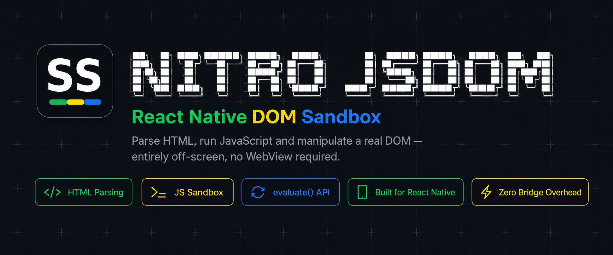

<p align="center">
  
</p>

<h1 align="center">react-native-nitro-jsdom</h1>

<p align="center">
  <strong>A headless HTML/DOM environment for React Native</strong>
</p>

<p align="center">
  
  
  
  
  
</p>

---

React Native has no native equivalent of [jsdom](https://github.com/jsdom/jsdom). When you need to parse an HTML document, manipulate its DOM, or run arbitrary JavaScript inside it, without rendering anything on screen, your only option today is a `WebView`, a visual component that ties your business logic to the UI layer and drags in a full browser engine just to evaluate a script.

**react-native-nitro-jsdom** solves this by providing a real, isolated HTML + JS sandbox, powered by [Nitro Modules](https://nitro.margelo.com/), that runs entirely off-screen and off the React tree.

```ts
import { JSDOM } from 'react-native-nitro-jsdom'

const dom = JSDOM.create(`
  <html>
    <body>
      <div id="result">0</div>
    </body>
  </html>
`)

await dom.evaluate(`
  document.getElementById('result').textContent = String(2 + 2)
`)

const value = await dom.evaluate(`document.getElementById('result').textContent`)
// → "4"

dom.dispose()
```

## Features

- **Headless & off-tree** - no React component, no screen, no UI tree. Parse, mutate, and evaluate HTML entirely off-screen.
- **Truly isolated runtime** - every `JSDOM.create()` spins up its own QuickJS runtime, not a shared Hermes instance. No leaking globals between sandboxes.
- **Native HTML parsing** - backed by [Lexbor](https://github.com/lexbor/lexbor), the fastest WHATWG-compliant HTML parser in C99, with zero dependencies.
- **jsdom-shaped DOM API** - `querySelector`, `textContent`, `dataset`, and more mirror jsdom's DOM shape, though usage differs: everything runs through the async `evaluate()`, not jsdom's synchronous object access.
- **Synchronous JSI bridge** - powered by Nitro Modules, with direct JSI calls, no bridge, no JSON serialization overhead.
- **Full memory control** - call `dispose()` to deterministically free the Lexbor document and QuickJS runtime, no waiting on GC.

## Installation

### Requirements

| Component | Requirement |
|-----------|-------------|
| React Native | 0.76.0 or higher, with the **New Architecture** (Fabric + TurboModules) enabled |
| Node.js | 18.0.0 or higher |
| `react-native-nitro-modules` | Required peer dependency |

```bash
yarn add react-native-nitro-jsdom react-native-nitro-modules
```

For iOS, install pods:

```bash
cd ios && pod install && cd ..
```

For Android, the package auto-links. Run a Gradle sync if needed.

See the [Compatibility page](https://salve-software.github.io/react-native-nitro-jsdom/docs/compatibility) for platform details (iOS, Android, visionOS) and Expo notes.

## Usage

Full docs, architecture, and API reference: **[salve-software.github.io/react-native-nitro-jsdom](https://salve-software.github.io/react-native-nitro-jsdom)**

## Contributing

We welcome contributions! See [CONTRIBUTING.md](./CONTRIBUTING.md) for setup instructions, branch/commit conventions, and the PR process.

## License

This project is licensed under the MIT License, see [LICENSE](./LICENSE) for details.

---

<p align="center">
  Made by Salve Software
</p>
